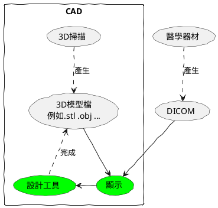

### twcb spec html

```
@startuml
skinparam handwritten true

note top of twcbflow: "藍色是與介面整合的"
note bottom of jquery: "綠色是全域lib"
note top of DText : "interface 在 js 中，主要配合 jsdoc 語法用"

class twcbflow #white-blue
class cbolflow #white-blue
class cvtDTextsToHtml #white-blue
class linqjs #white-green
class jquery #white-green
interface DText

twcbflow .> splitBtw
twcbflow .> splitBrOne
twcbflow .> splitReference
twcbflow .> linqjs

cbolflow .> splitBrOne

cvtDTextsToHtml .> jquery
cvtDTextsToHtml .> DText

splitBtw ..> matchGlobalWithCapture
splitBtw ..> linqjs

splitBrOne .> splitStringByRegex

splitStringByRegex ..> matchGlobalWithCapture

splitReference ..> splitStringByRegex
splitReference ..> BibleConstant
splitReference ..> BibleConstantHelper
splitReference ..> linqjs

BibleConstantHelper ..> BibleConstant
BibleConstantHelper ..> linqjs


@enduml
```

## 單獨 (開發單位-從上面複製下來)
### twcbflow 
```plantuml
@startuml
skinparam handwritten true

note top of twcbflow: "藍色是與介面整合的"
note bottom of linqjs: "綠色是全域lib"

class twcbflow #white-blue
class linqjs #white-green

twcbflow .> splitBtw
twcbflow .> splitStringByRegex
twcbflow .> splitReference
twcbflow .> linqjs

splitBtw ..> matchGlobalWithCapture
splitBtw ..> linqjs

splitStringByRegex ..> matchGlobalWithCapture

splitReference ..> splitStringByRegex
splitReference ..> BibleConstant
splitReference ..> BibleConstantHelper
splitReference ..> linqjs

BibleConstantHelper ..> BibleConstant
BibleConstantHelper ..> linqjs

@enduml
```

### cvtDTextsToHtml
```plantuml
@startuml
skinparam handwritten true

note top of cvtDTextsToHtml: "藍色是與介面整合的"
note bottom of jquery: "綠色是全域lib"
note top of DText : "interface 在 js 中，主要配合 jsdoc 語法用"

class cvtDTextsToHtml #white-blue
class jquery #white-green
interface DText

cvtDTextsToHtml .> jquery
cvtDTextsToHtml .> DText

@enduml

```

## 思考 click 事件



